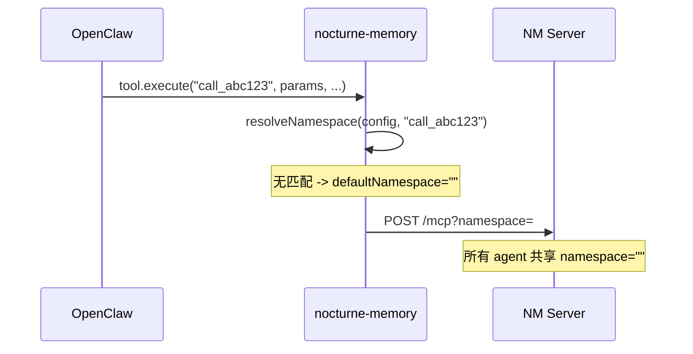

# Namespace 隔离完整修复计划

## 根因

OpenClaw 调用 `tool.execute(toolCallId, params, signal, onUpdate)` 时，第一个参数是 **toolCallId**（如 `"call_abc123"`），不是 agentId。
插件 `index.ts` 将其误当 agentId 传入 `resolveNamespace`，导致所有 agent 都 fallback 到 `defaultNamespace: ""`，共享同一个命名空间。




正确做法：使用 `OpenClawPluginToolFactory`，在工厂函数中通过 `ctx.agentId` 获取真实 agent ID。

---

## P0: 修复 OpenClaw 插件（openclaw-nocturne-memory）

### 改动文件

- [index.ts](/Volumes/Extra disk/Directories/Users/pandy/ai-code/openclaw-nocturne-memory/index.ts) -- `registerAllTools` 函数

### 改动内容

将工具注册从「传入对象」改为「传入工厂函数」：

```typescript
// BEFORE (错误):
api.registerTool({
  name: tool.name,
  description: tool.description,
  parameters: tool.parameters,
  async execute(agentId: string, params: Record<string, unknown>) {
    return proxy(config, agentId, tool.mcpName, params);
  },
});

// AFTER (正确):
api.registerTool(
  (ctx: { agentId?: string }) => ({
    name: tool.name,
    description: tool.description,
    parameters: tool.parameters,
    async execute(_toolCallId: string, params: Record<string, unknown>) {
      return proxy(config, ctx.agentId ?? "", tool.mcpName, params);
    },
  }),
  { name: tool.name },
);
```

关键点：

- `ctx.agentId` 在 OpenClaw 调用 `resolvePluginTools` 时已确定，对应当前 agent 的 ID
- 工厂函数每次 resolve 时都会被调用，agentId 被闭包捕获
- 需要在 `opts` 中显式传 `name`，因为工厂函数无法从函数体推断工具名

### 单 namespace 用户兼容性

- 若配置中无 `agents` 映射，所有 agentId 都 fallback 到 `defaultNamespace`（行为与修复前一致）
- 若 `defaultNamespace` 为空字符串（默认），与之前的错误行为恰好一致 -- 迁移后数据无感

---

## P1: 修复 get_children 跨 namespace 泄漏（nocturne_memory_fork）

### 改动文件

- [backend/db/graph.py](/Volumes/Extra disk/Directories/Users/pandy/ai-code/nocturne_memory_fork/backend/db/graph.py) -- `get_children` 方法

### 改动原则（最小侵入）

不重构 `get_children` 的整体结构，仅在已有的「查 Path」分支中，对「当前 namespace 下无 Path 的子边」添加 `continue` 跳过，而不是用 `edge.name` 做 fallback。

伪代码（定位到 `get_children` 中 `path_obj` 为空的分支）：

```python
# 现有逻辑: path_obj 为空时用 edge.name fallback
# 修改: 如果当前 namespace 下没有任何 Path 指向该 edge，跳过该子节点
if not path_obj:
    continue  # 不暴露跨 namespace 的子节点
```

### 单 namespace 用户兼容性

- 单 namespace 下，所有子边都有 Path，`path_obj` 不可能为空 -- 逻辑不变
- 仅多 namespace 时，跨 namespace 的「幽灵子节点」不再出现

### 对上游升级的影响

- 仅修改 `get_children` 函数中 1 个条件分支
- 如果上游重构了 `get_children`，merge 时人工判断是否需要移植此 fix（变更极小，冲突概率低）

---

## P2: Changeset Store namespace 感知（nocturne_memory_fork）

### 改动文件

- [backend/db/snapshot.py](/Volumes/Extra disk/Directories/Users/pandy/ai-code/nocturne_memory_fork/backend/db/snapshot.py)
- [backend/mcp_server.py](/Volumes/Extra disk/Directories/Users/pandy/ai-code/nocturne_memory_fork/backend/mcp_server.py) -- `_record_rows` helper
- [backend/api/review.py](/Volumes/Extra disk/Directories/Users/pandy/ai-code/nocturne_memory_fork/backend/api/review.py) -- groups/diff/rollback endpoints

### 方案：per-namespace changeset 文件（最小侵入）

将 `changeset.json` 拆为 `changeset_{namespace}.json`，namespace 为空时仍用 `changeset.json`（向后兼容）。

**snapshot.py 改动**：

- `ChangesetStore.__init`__ 新增可选 `namespace` 参数
- `_changeset_path` 属性根据 namespace 生成文件名
- 新增类方法 `for_namespace(ns)` 返回对应实例
- 全局单例 `_store` 改为 `_stores: Dict[str, ChangesetStore]`

```python
@classmethod
def for_namespace(cls, ns: str = "") -> "ChangesetStore":
    global _stores
    if ns not in _stores:
        _stores[ns] = cls(namespace=ns)
    return _stores[ns]

@property
def _changeset_path(self) -> str:
    suffix = f"_{self._namespace}" if self._namespace else ""
    return os.path.join(self.snapshot_dir, f"changeset{suffix}.json")
```

**mcp_server.py 改动**：

- `_record_rows()` 中 `get_changeset_store()` 改为 `ChangesetStore.for_namespace(get_namespace())`

**review.py 改动**：

- 每个 endpoint 中 `get_changeset_store()` 改为 `ChangesetStore.for_namespace(get_namespace())`
- 由于 Review API 请求也经过 `NamespaceMiddleware`，`get_namespace()` 已是当前请求的 namespace

### 单 namespace 用户兼容性

- namespace 为空（默认）时，文件名仍为 `changeset.json` -- 完全兼容
- 已有的 `changeset.json` 不需要迁移

### 对上游升级的影响

- `snapshot.py`：核心逻辑（`record`/`record_many`/`_gc_noop_creates`）不变，仅改文件路径计算和单例管理
- `mcp_server.py`：仅改 `_record_rows` 中 1 行 store 获取方式
- `review.py`：每个 endpoint 头部改 1 行 store 获取方式
- 合并冲突概率低，即使有冲突也是 import/单行替换

---

## P3: 前端 Namespace 选择器（nocturne_memory_fork/frontend）

### 改动文件

- [frontend/src/lib/api.js](/Volumes/Extra disk/Directories/Users/pandy/ai-code/nocturne_memory_fork/frontend/src/lib/api.js) -- axios 拦截器
- [frontend/src/App.jsx](/Volumes/Extra disk/Directories/Users/pandy/ai-code/nocturne_memory_fork/frontend/src/App.jsx) -- Layout 顶栏 + Context
- [backend/api/browse.py](/Volumes/Extra disk/Directories/Users/pandy/ai-code/nocturne_memory_fork/backend/api/browse.py) -- 新增 namespace 列表端点

### api.js 改动（1 行追加）

在现有请求拦截器中追加 `X-Namespace` header：

```javascript
api.interceptors.request.use((config) => {
  const token = localStorage.getItem('api_token');
  if (token) {
    config.headers.Authorization = `Bearer ${token}`;
  }
  const ns = localStorage.getItem('selected_namespace');
  if (ns) {
    config.headers['X-Namespace'] = ns;
  }
  return config;
});
```

### App.jsx 改动

在 `Layout` 顶栏导航右侧添加 namespace 下拉选择器：

- 调用 `GET /browse/namespaces` 获取可用 namespace 列表
- 选择后存入 `localStorage("selected_namespace")`
- 触发页面刷新以加载对应 namespace 数据
- 默认显示 "(default)" 表示空 namespace

### browse.py 新增端点

```python
@router.get("/namespaces")
async def list_namespaces():
    """Return all distinct namespaces from the paths table."""
    db = get_db_manager()
    async with db.session() as session:
        result = await session.execute(
            select(distinct(PathModel.namespace)).order_by(PathModel.namespace)
        )
        return [row[0] for row in result.all()]
```

### 单 namespace 用户兼容性

- `localStorage` 无 `selected_namespace` 时，不发送 `X-Namespace` header -> 后端 middleware 默认 `""` -> 行为不变
- Namespace 选择器为空列表时显示 "(default)" -> 单 namespace 用户看不到任何变化

### 对上游升级的影响

- `api.js`：仅追加 3 行到现有拦截器
- `App.jsx`：在 Layout 组件中新增 1 个子组件（下拉选择器），不动现有结构
- `browse.py`：纯新增端点，不修改现有函数
- 合并冲突概率极低

---

## 执行顺序

1. **P0**: 修复插件 `index.ts` -> 重启 OpenClaw 验证日志输出的 namespace
2. **P1**: 修复 `get_children` -> 运行 Nocturne Memory 测试验证
3. **P2**: Changeset 分文件 -> 重启后端，验证 Review 页面按 namespace 分组
4. **P3**: 前端选择器 -> 验证切换 namespace 后 Browse/Review 数据正确隔离

